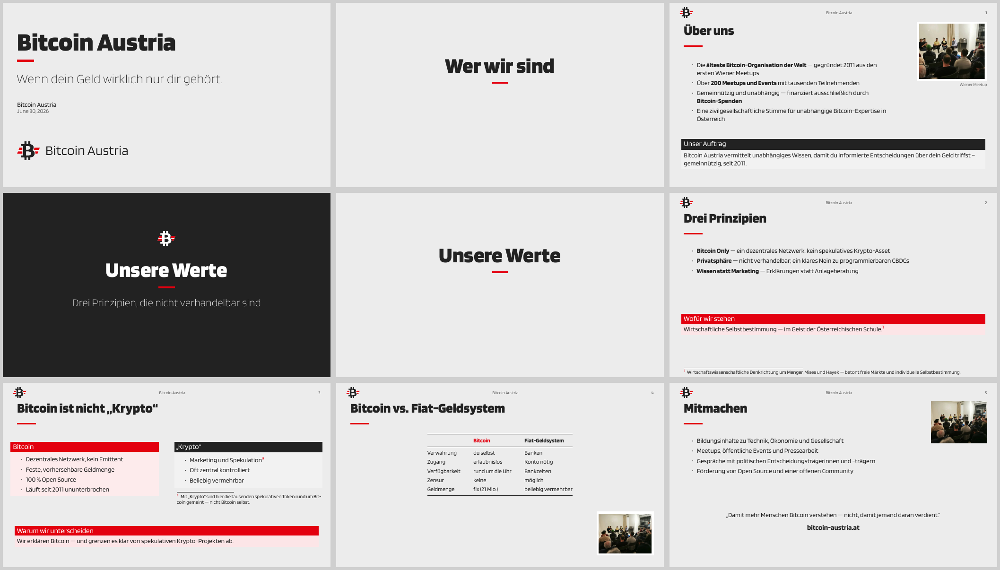

# Bitcoin Austria — Beamer Style (2026)

A LaTeX **Beamer** theme implementing the Bitcoin Austria 2026 brand, packaged
for reuse across presentations (consumed as a **git submodule**).

  

## Preview



A rendered sample of the current style. The full deck is committed in **both
aspect ratios** — **[`example/demo.pdf`](example/demo.pdf)** (16:9, the standard)
and **[`example/demo-43.pdf`](example/demo-43.pdf)** (4:3) — open them side by
side to see how the theme arranges the *same* slides in each format. (The PDFs
and montages are regenerated from `example/demo-common.tex`; rebuild the decks
with `cd example && make`, and the preview montages with `make preview`.)

## What's in here

| Path | Purpose |
|------|---------|
| `bitcoin-austria.sty` | the Beamer style package |
| `fonts/` | Blinker typeface (SIL OFL 1.1) + license |
| `assets/` | logo (dark logomark + horizontal lockup), PNG for builds, SVG sources |
| `example/` | a minimal demo deck that doubles as the CI self-test |

**Brand:** light-grey `#ECECEC` canvas · red `#E3000F` accent · black `#222222`
text · Blinker font · dark logomark top-left · running title centre · frame
number top-right · bold headlines with a short red accent rule.

Slide macros provided by the package:

- `\comparisonslide{title}{Lhead}{Lbody}{Rhead}{Rbody}{noteHead}{noteBody}` —
  a two-column comparison (red accent left, dark accent right) with an optional
  full-width callout underneath.
- `\fillerslide[subtitle]{headline}` — a dark-background topic-divider slide
  (light logomark, white headline, red accent rule).
- `\fullbleedslide[caption]{image}` — a frame whose image fills the slide edge
  to edge, with an optional caption bar (e.g. a source URL).
- `\comparisontable{Lhead}{Rhead}{rows}` — a booktabs side-by-side comparison
  table (red left column, dark right column); used inside a frame.
- `\cornerimage[options]{image}` — floats a small image into a slide corner,
  **over** everything else, so it works even on theme-generated slides (call it
  right before the slide/macro). It clears the logo/title band by default and
  never collides with the brand furniture. `\cornerimage*` persists the image
  across the following slides (until `\clearcornerimage`). See below.

Blocks are rectangular (sharp-edged) to match the brand's geometric style.

### `\cornerimage` — corner overlays with cropping

```latex
\cornerimage{photo}                               % default: top-right, ~0.13\paperwidth
\cornerimage[3cm]{photo}                           % bare width (backward compatible)
\cornerimage[corner=bottom-left, width=0.18\paperwidth, border]{photo}
\cornerimage[viewport=150 90 760 600, clip, caption=Wiener Meetup]{photo}  % crop a region
```

Call it **immediately before** the frame (or slide macro) you want to decorate;
the unstarred form paints only the next page, so it never bleeds onto the slide
after. Key=value options:

| key | meaning |
|-----|---------|
| `width=<len>` | image width (default `0.13\paperwidth`) |
| `height=<len>` | cap the height too (keeps aspect ratio) |
| `corner=<pos>` | `top-right` (default), `top-left`, `bottom-right`, `bottom-left` |
| `trim=<l b r t>` | **crop** by these amounts (implies `clip`) |
| `viewport=<llx lly urx ury>` | **crop** to this source region (implies `clip`) |
| `clip=true\|false` | clip to the crop box (auto-on with `trim`/`viewport`) |
| `border=true\|false` | white matte frame around the image |
| `caption=<text>` | small caption under the image, aligned to its outer edge |
| `hmargin` / `vmargin` / `topclear` | override the brand edge gaps (pt/len) |

> The overlay floats on top and does **not** reflow text — on a normal content
> frame, keep the body clear of the corner (e.g. set it in a narrower column),
> as the demo's *Über uns* slide does.

## Requirements

- **XeLaTeX** (the package loads Blinker via `fontspec`).
- A current LaTeX kernel (2020-10+) — uses `\CurrentFilePath` to self-locate.
- `latexmk` to build (recommended).
- **Aspect ratio:** works at any beamer `aspectratio` — the demo ships in 16:9
  (`aspectratio=169`, the standard) and **4:3** (`aspectratio=43`); just set the
  documentclass option. The theme uses relative lengths and **adapts the
  typography automatically** on narrower formats (see below).

### Aspect ratio & narrow-format scaling

16:9 is the design baseline. On any **narrower-than-16:9** canvas (4:3, 5:4,
14:9, …) beamer would otherwise keep the same physical point sizes on a ~20%
narrower column, which both looks oversized and makes **text-dense slides
overflow the bottom** (the column loses width faster than the page gains
height). The theme corrects this automatically, scaled **smoothly with
`\paperwidth`** (no hard 4:3-only switch), with three layered levers:

1. **tighter list spacing** on narrow formats (no font shrink);
2. **display headings** scaled down to ~0.90 at 4:3;
3. the **body size tree** scaled gently to ~0.92 at 4:3.

**16:9 (and wider, e.g. 16:10) is left byte-for-byte unchanged** — every lever is
a no-op there. For the rare slide that is *still* too dense at 4:3, two escapes:

- `\narrowonly{<code>}` — runs `<code>` only on narrow formats, e.g. put
  `\narrowonly{\small}` at the top of one packed frame;
- beamer's native `\begin{frame}[shrink]` — measures the frame and scales only if
  it overflows (note: it also scales images and varies the size per slide).

> Width-keyed scaling is intentionally simple and covers the common ratios well;
> *wide-but-short* formats like 3:2 (90 mm tall) can still overflow a very dense
> slide a little — reach for `\narrowonly`/`[shrink]` there.

## Use it in a presentation (git submodule)

```bash
# from your presentation repo:
git submodule add git@github.com:<owner>/latex-beamer-style-2026.git theme
git commit -m "Add Bitcoin Austria beamer style as submodule"
```

In your `.tex` (compiled from the repo root), load it **by path**:

```latex
\documentclass[aspectratio=169,t,9pt]{beamer}
\usepackage{theme/bitcoin-austria}   % theme/ = the submodule directory
```

The package finds its own `fonts/` and `assets/` automatically, wherever the
submodule is mounted. If auto-detection ever fails, set the directory yourself
before loading:

```latex
\def\bitcoinaustriaroot{theme/}      % note the trailing slash
\usepackage{theme/bitcoin-austria}
```

> **Cloning a repo that uses this theme:** the submodule must be checked out, or
> the build fails with a missing-package error:
> ```bash
> git clone --recurse-submodules <repo-url>
> # or, in an existing clone:
> git submodule update --init --recursive
> ```

## Build the demo

```bash
cd example
make                  # both decks:  demo.pdf (16:9)  +  demo-43.pdf (4:3)
make preview          # regenerate the README montages (needs ImageMagick)
```

Or build a single ratio directly:

```bash
latexmk -xelatex demo.tex      # -> demo.pdf     (16:9, the standard)
latexmk -xelatex demo-43.tex   # -> demo-43.pdf  (4:3)
```

Both decks share their slides via `demo-common.tex`; the two wrapper files differ
only in the `aspectratio=` documentclass option, so the comparison is apples to
apples.

## Licensing

- Package code (`bitcoin-austria.sty`, build files): **Apache-2.0** (see `LICENSE`).
- **Blinker** font: **SIL Open Font License 1.1** (see `fonts/BLINKER-OFL-License.txt`).
- Bitcoin Austria logo/marks: © Bitcoin Austria — brand assets, used for
  Bitcoin Austria presentations.
